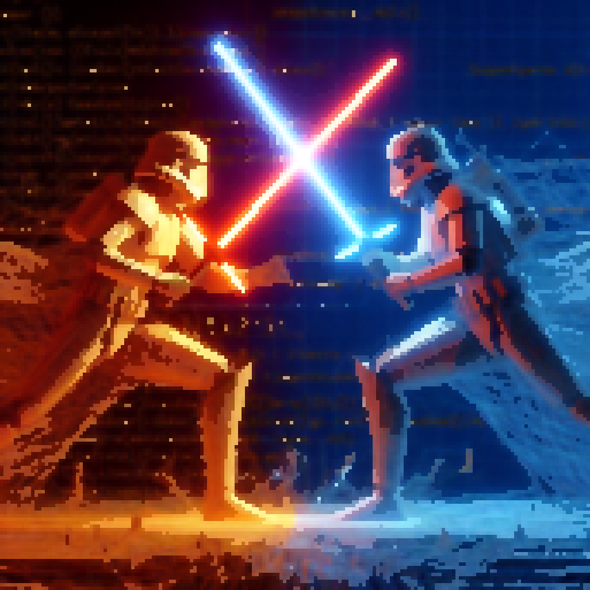
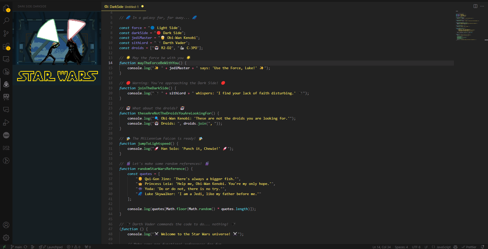
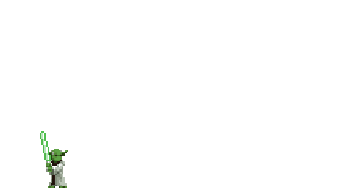

# VS Darkside 🚀🌑

Turn your development journey into a galactic experience with **VS-Darkside**! Inspired by *Star Wars*, this extension brings the excitement of lightsaber battles, galactic animations, and immersive sounds to your coding environment. Join the dark side and let the force accompany you while you code!



---

## Output



---

## Features ✨

### 🖥️ **Star Wars Animations**
- Engage with beautiful Star Wars-themed animations that light up your workspace as you code.
- Customizable animations that can be triggered on events like saving, committing, or even typing!


---

### ⚔️ **Sidebar Battles**
- Experience lightsaber duels and space battles directly in the sidebar.
- Choose your allegiance (Dark Side or Light Side) and watch as iconic characters from *Star Wars* battle it out while you develop.
  
  

---

### 🔊 **Immersive Sounds**
- Hear the hum of lightsabers, TIE Fighters roaring, and R2-D2 chirping while you code.
- Set up custom sound triggers for specific actions such as opening files, running code, or achieving important coding milestones.



---

## Installation 🔧

1. **Open Visual Studio Code**.
2. **Search for "VS-Darkside"** in the Extensions marketplace.
3. Click **Install** and you're ready to enter the galaxy!

---

## Usage Guide 📖

### **Toggling Animations**
- Use the command palette (`Ctrl + Shift + P`) and type `VS-Darkside: Toggle Animation` to enable/disable animations.

### **Choose Your Side**
- Pick your side (Dark or Light) using the `VS-Darkside: Choose Your Side` command, and the battle scenes will change accordingly.

### **Adjust Sound Settings**
- You can control the volume or mute specific sounds via `VS-Darkside: Sound Settings`.

---

## Customization 🛠️

### **Theme and Colors**
- Match the visual theme to your coding preference: Dark Side (Sith red) or Light Side (Jedi blue).

### **Animation Triggers**
- Set specific triggers for animations and sounds in your settings JSON, such as `onFileSave`, `onGitCommit`, etc.

### Example:
```json
"vs-darkside.triggers": {
    "onFileSave": "lightsaber-swipe",
    "onGitCommit": "space-battle"
}
```

---

## Contribution 💻

Want to make this extension even more epic? Fork it on GitHub and submit a pull request! Contributions for new animations, sounds, and features are always welcome.

---

## License 📜

This project is licensed under the MIT License.

Please refer to [LICENSE.md](LICENSE.md)

---

May the force be with you! 🌌
